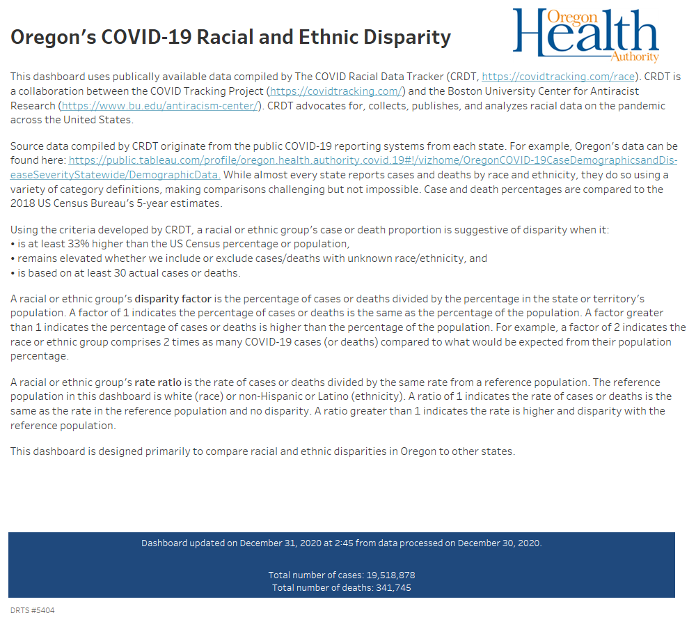

# COVID-19 Racial and Ethnicity Disparity Dashboard

## Documentation

Item | Notes
-----|------
DRTS number | 5404
Requestor | Patrick Allen (Patrick.Allen@dhsoha.state.or.us), Oregon Health Authority
Request date | 2020-07-01
Expected delivery date | 2020-07-15
Description of request product | Tableau dashboard
Data source(s) | External publicly available data source. Link: https://covidtracking.com/race
PHI level | Aggregated, no PHI
Frequency | Twice weekly
Query parameters | NA
Unit of analysis | NA
Data elements | NA
Lead HA analyst(s) | Benjamin Chan (benjamin.chan@dhsoha.state.or.us) Health Analytics

## Version control

Item | Notes
-----|------
HA analyst | Benjamin Chan (benjamin.chan@dhsoha.state.or.us) Health Analytics
Version date | 2020-12-31
Version description | Build 2020-12-31
Build summary | Windows Task Scheduler automatically executes `make.bat` early Monday and Thursday mornings. `make.bat` calls `mungeData.R` and builds Tableau-ready CSV data sources.
Product(s) | `Covid19 Racial and Ethnic Disparity.twb`
Control totals | See `Data\control_totals.csv`
Product delivered to | Dashboard published to external Tableau server for internal use only. Link: https://visual-data.dhsoha.state.or.us/t/OHA/views/Covid19RacialandEthnicDisparity/About

## Context

This project takes existing data from The COVID Racial Data Tracker and reforms
it to display a comparison between Oregon and other states and territories.

The genesis of this project was this email message:

> On Jul 1, 2020, at 9:50 AM, Allen Patrick <Patrick.Allen@dhsoha.state.or.us> wrote:
> 
> Jeremy,
> 
> Do you have anyone who could spend a little time on a data analysis project for
> me? The link below is to racial disparity data from covid. I need someone to a)
> validate that we agree with the reported data (some of the data looks a little
> off to me), and then b) figure out a way to display or describe the data in a
> way that benchmarks our disparities against other states.
> 
> Here's the link:
> 
> https://covidtracking.com/race/dashboard
> 
> Let me know if you’ve got someone to hand this off to. Thanks!
> 
> Pat.

## Project status

Active development on pause since late-July 2020.
Data updates and dashboard publication are currently maintained (Mondays and Thursdays).

## Dashboard

Screen captures of the dashboard product.

## Source information

Links to source data from The COVID Racial Data Tracker:

* [Main page](https://covidtracking.com/race)
* [Dashboard](https://covidtracking.com/race/dashboard/)
* [About](https://covidtracking.com/race/about)
* [CSV](https://docs.google.com/spreadsheets/d/e/2PACX-1vR_xmYt4ACPDZCDJcY12kCiMiH0ODyx3E1ZvgOHB8ae1tRcjXbs_yWBOA4j4uoCEADVfC1PS2jYO68B/pub?gid=43720681&single=true&output=csv)
  * Google Docs spreadsheet
  * The data is not currently packaged in The COVID Racial Data Tracker's data API
  * Data is "updated twice per week"; from what I can tell it's updated on Sunday and Wednesday
* [Github](https://github.com/COVID19Tracking)
  * This didn't prove to be too terribly useful; it houses the repos for their main data products

Links to OHA's data visualizations

* [Table form](https://public.tableau.com/profile/oregon.health.authority.covid.19#!/vizhome/OregonCOVID-19CaseDemographicsandDiseaseSeverityStatewide-SummaryTable/DemographicDataSummaryTable)
* [Data viz form](https://public.tableau.com/profile/oregon.health.authority.covid.19#!/vizhome/OregonCOVID-19CaseDemographicsandDiseaseSeverityStatewide/DemographicData)

## Build

1. Run the `make.bat` script from the Windows command line
   1. The script executes `mungeData.R`, which creates the source data file, `Data\disparity_data.csv`, for the Tableau workbook
   2. The data file is timestamped and version controlled
2. Publish `Covid19 Racial and Ethnic Disparity.twb` to the internal Tableau server

## To do:

* Investigate why AI/AN for Washington does not get flagged as disparate (where it does in the CRDT dashboard)
  * I suspect CRDT's flag is a result of rounding/precision error
  * Could also be that the ACS data I'm pulling is not the same as the ACS data CRDT uses
  * Email query sent to racial.data@covidtracking.com on 2020-07-07
* **[Won't fix]** Fix the doughnut hole selection issue
  * Does not seem possible without sacrificing other functionality
  * https://community.tableau.com/s/question/0D54T00000C6ZzESAV/doughnut-selectionhover-issue
* **[Incomplete solution]** Automate or semi-automate the build workflow
  * Would like to combine steps 1 and 2
  * Step 1 of build is accomplished with the Windows Task Scheduler
  * Still need to automate step 2: publish
* Duplicate ranking dashboard for `disparity_excess_pct`
* Add *Insufficient data* filter to the hex map
  * https://www.npr.org/sections/health-shots/2020/09/23/914427907/as-pandemic-deaths-add-up-racial-disparities-persist-and-in-some-cases-worsen

## Press

* The NY Times has some disparity data I would like to get my hands on
  * https://www.nytimes.com/interactive/2020/07/05/us/coronavirus-latinos-african-americans-cdc-data.html
  * Their data is from the CDC and was obtained by a FOIA request
* Northwestern also has some disparity data
  * https://www.ipr.northwestern.edu/news/2020/covid-magnifies-racial-disparities.html
  * Survey data and not broken out by state

## Disparity indices

* https://www.rdocumentation.org/packages/dineq/versions/0.1.0
* https://www.acepidemiology.org/assets/docs/Goodman%20ACE%20Final%20revised.pdf
* Harper S, Lynch J. Selected Comparisons of Measures of Health Disparities: A Review Using Databases Relevant to Healthy People 2010 Cancer-Related Objectives. NCI Cancer Surveillance Monograph Series, Number 7. National Cancer Institute. NIH Pub. No. 07-6281, Bethesda, MD, 2007.
  * https://seer.cancer.gov/publications/disparities2
* Lynne C. Messer, Invited Commentary: Measuring Social Disparities in Health—What Was the Question Again?, American Journal of Epidemiology, Volume 167, Issue 8, 15 April 2008, Pages 900–904, https://doi.org/10.1093/aje/kwn019
* Rossen LM, Schoendorf KC. Measuring health disparities: trends in racial-ethnic and socioeconomic disparities in obesity among 2- to 18-year old youth in the United States, 2001-2010. Ann Epidemiol. 2012 Oct;22(10):698-704. doi: 10.1016/j.annepidem.2012.07.005. Epub 2012 Aug 11. PMID: 22884768; PMCID: PMC4669572.
  * https://www.ncbi.nlm.nih.gov/pmc/articles/PMC4669572/
* Hosseinpoor AR, Bergen N, Barros AJ, Wong KL, Boerma T, Victora CG. Monitoring subnational regional inequalities in health: measurement approaches and challenges. Int J Equity Health. 2016 Jan 28;15:18. doi: 10.1186/s12939-016-0307-y. PMID: 26822991; PMCID: PMC4730638.
  * https://www.ncbi.nlm.nih.gov/pmc/articles/PMC4730638/
* Keppel K, Pamuk E, Lynch J, Carter-Pokras O, Kim Insun, Mays V, Pearcy J, Schoenbach V, Weissman JS. Methodological issues in measuring health disparities. Vital Health Stat 2. 2005 Jul;(141):1-16. PMID: 16032956; PMCID: PMC3681823.
  * https://www.ncbi.nlm.nih.gov/pmc/articles/PMC3681823/
* Haughton, Jonathan; Khandker, Shahidur R.. 2009. Handbook on Poverty and Inequality. Washington, DC: World Bank. © World Bank. https://openknowledge.worldbank.org/handle/10986/11985 License: CC BY 3.0 IGO.
* Borrell LN, Talih M. A symmetrized Theil index measure of health disparities: An example using dental caries in U.S. children and adolescents. Stat Med. 2011 Feb 10;30(3):277-90. doi: 10.1002/sim.4114. Epub 2010 Nov 5. PMID: 21213344; PMCID: PMC3059777.
  * https://www.ncbi.nlm.nih.gov/pmc/articles/PMC3059777/
* Health Equity Assessment Toolkit (HEAT): Software for exploring and comparing health inequalities in countries. Built-in database edition. Version 2.0. Geneva, World Health Organization, 2017.
  * https://www.who.int/gho/health_equity/heat_technical_notes.pdf
